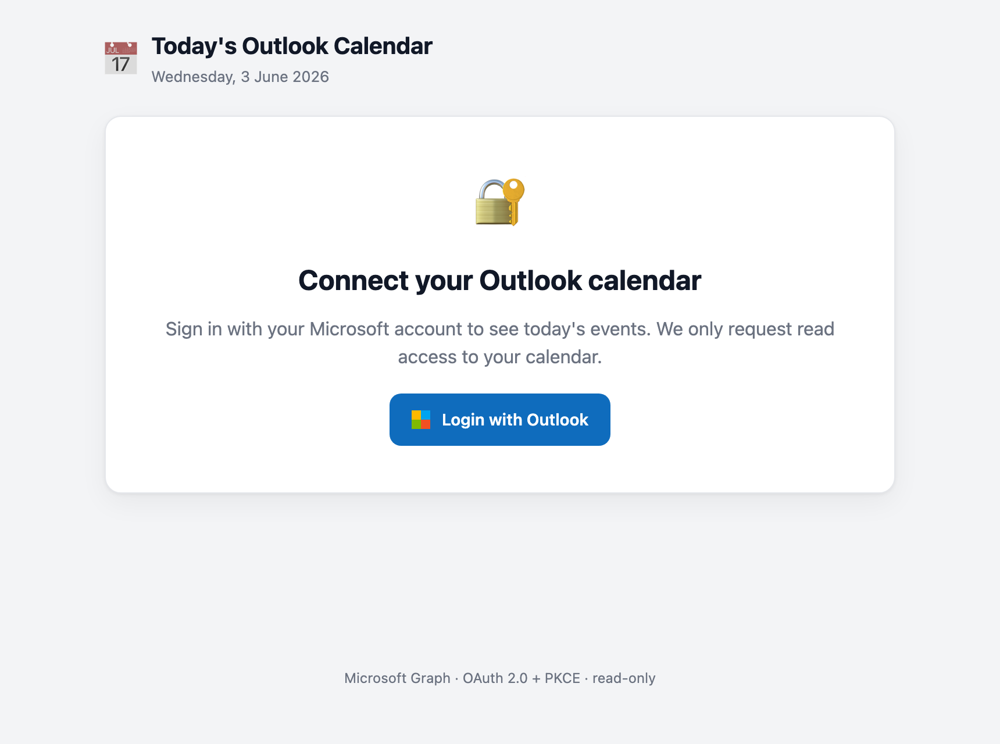
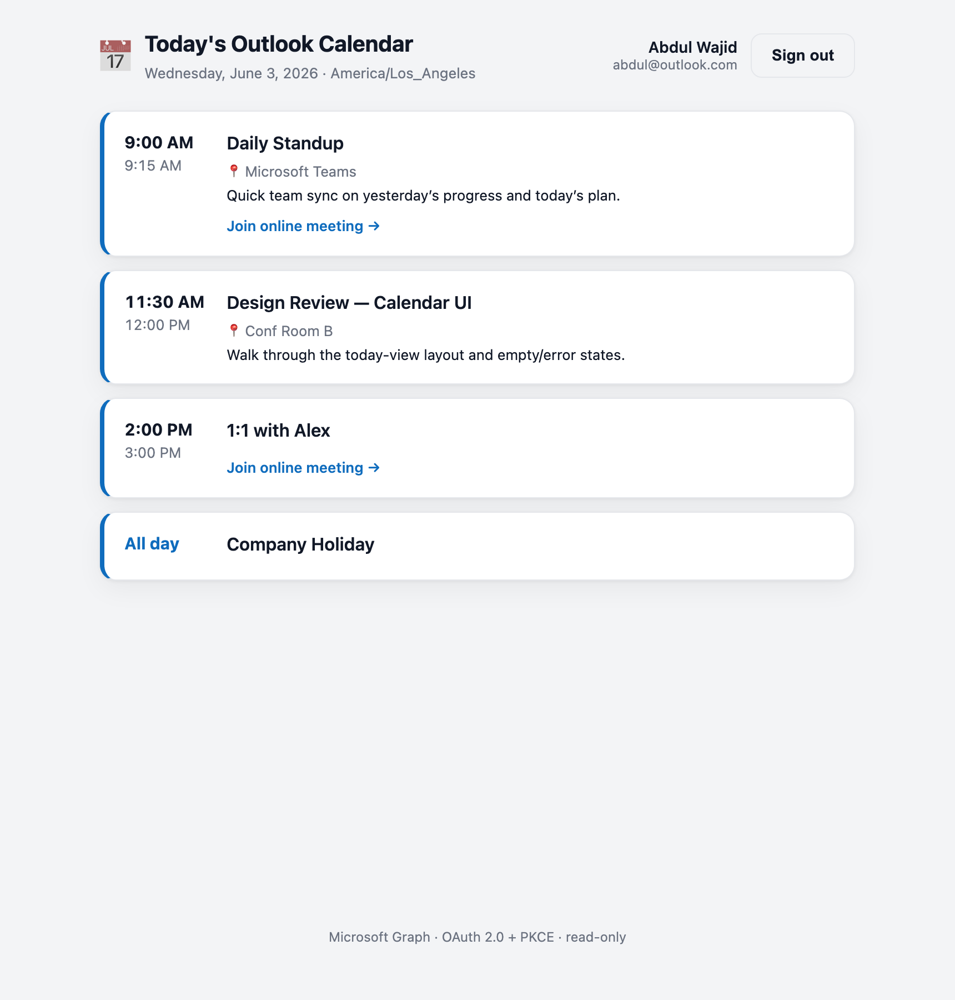

# Outlook Calendar Integration — Proof of Concept

Login with a Microsoft / Outlook account and see your **calendar events for
any day**, fetched from the **Microsoft Graph API** — plus a physician
intelligence layer for salespeople:

- **Physician directory** (21k+ NPIs from BIS CSVs): event attendees are
  matched by email; matched physicians open an inline profile with specialty,
  contact info and primary facility.
- **Procedure analytics** (optional SQLite ingest): volume by year, payer mix,
  top CPT codes with reimbursement rates, facilities.
- **Call notes**: per-organizer history with each physician, a "last
  call" reminder when scheduling, and auto-inclusion of the latest note in the
  next invite.
- **Scheduling + briefing**: send an Outlook invite to a physician straight
  from an event, or email yourself a full briefing (details + analytics + call-note
  history).

Built as a small, modular, production-quality demo intended to drop into a
larger AI-agent system later. The auth and Graph layers (`src/auth.js`,
`src/graph.js`) are framework-agnostic and reusable on their own.

---

## Screenshots

| Login (logged out) | Today's events |
| :---: | :---: |
|  |  |

> The events screenshot uses sample data to illustrate the UI (event titles,
> times, location, description, online-meeting link, and an all-day event).

**Live demo:** deploy your own in a few clicks — see [DEPLOY.md](DEPLOY.md).
(A public hosted instance requires your Azure credentials, so it isn't shared
here.)

---

## How it works

```
Browser  ──"Login with Outlook"──▶  /auth/login
                                      │  builds Microsoft sign-in URL (PKCE)
                                      ▼
                              login.microsoftonline.com  ──▶ user signs in & consents
                                      │
        /auth/callback  ◀── ?code&state ┘
            │  validate state, exchange code (+PKCE verifier) for tokens
            │  store tokens server-side in the session token cache
            ▼
Browser  ──GET /api/calendar/day──▶  Graph /me/calendarView  ──▶ that day's events
            │                          + attendee ↔ physician matching (CSV directory)
            ▼                          + organizer's latest call note per physician
        Clean UI renders events; matched attendees open an inline
        physician panel (details, analytics, call notes, actions)
```

**Security model**

- OAuth 2.0 **Authorization Code flow with PKCE** (`@azure/msal-node`).
- Tokens **never reach the browser** — the client only holds a signed,
  `httpOnly`, `SameSite=Lax` session cookie.
- Sessions (and the MSAL token cache inside them) persist in SQLite
  (`data/sessions.db`), so logins survive server restarts; expired access
  tokens are refreshed **silently** from the cached refresh token.
- Least privilege: only `User.Read`, `Calendars.ReadWrite` (create invites)
  and `Mail.Send` (briefing emails) are requested.

---

## Project structure

```
outlook-calendar-poc/
├── server.js                  # Express app: SQLite-backed sessions, routes, static, errors
├── src/
│   ├── config.js              # Env loading + validation (single source of truth)
│   ├── auth.js                # MSAL: auth URL, code exchange, silent token (REUSABLE)
│   ├── graph.js               # Graph: calendar fetch, create invite, briefing email (REUSABLE)
│   ├── physicians.js          # Physician + facility directory (CSV → in-memory index)
│   ├── notes.js               # Call notes store (SQLite, per organizer + NPI)
│   ├── analytics.js           # Procedure-volume queries over data/analytics.db
│   └── routes/
│       ├── auth.routes.js     # /auth/login, /auth/callback, /auth/logout
│       └── api.routes.js      # /api/* (see API reference)
├── scripts/
│   └── ingest.js              # npm run ingest — build data/analytics.db from BIS CSVs
├── data/
│   ├── physician_output_upload.csv   # directory source (committed)
│   ├── facility_output_upload.csv    # directory source (committed)
│   ├── sessions.db / notes.db / analytics.db   # runtime SQLite (gitignored)
├── public/                    # Dependency-free frontend (HTML/CSS/JS)
│   ├── index.html
│   ├── styles.css
│   └── app.js
├── .env.example
└── README.md
```

---

## 1. Register an app in Azure (Microsoft Entra)

You need an **Application (client) ID** and a **client secret**.

1. Go to the [Azure Portal](https://portal.azure.com) → search **"App registrations"** → **New registration**.
2. **Name**: e.g. `Outlook Calendar POC`.
3. **Supported account types**: choose
   **"Accounts in any organizational directory and personal Microsoft accounts"**
   (this enables Outlook.com / Hotmail / Microsoft 365 sign-in and maps to
   `MS_TENANT_ID=common`).
4. **Redirect URI**: platform **Web**, value:
   ```
   http://localhost:3000/auth/callback
   ```
5. Click **Register**.
6. On the **Overview** page, copy the **Application (client) ID** → `MS_CLIENT_ID`.
7. Go to **Certificates & secrets → Client secrets → New client secret**.
   Copy the secret **Value** (not the Secret ID) immediately → `MS_CLIENT_SECRET`.
8. Go to **API permissions → Add a permission → Microsoft Graph → Delegated permissions**
   and add:
   - `User.Read`
   - `Calendars.ReadWrite`
   - `Mail.Send`

   `openid`, `profile`, and `offline_access` are included automatically by MSAL.
   For personal/individual accounts no admin consent is needed; users consent at
   first sign-in.

> When you deploy, add your production HTTPS redirect URI (e.g.
> `https://yourdomain.com/auth/callback`) to the same app registration and update
> `REDIRECT_URI`.

---

## 2. Configure environment

```bash
cp .env.example .env
```

Fill in `.env`:

| Variable            | Description                                                        |
| ------------------- | ------------------------------------------------------------------ |
| `MS_CLIENT_ID`      | Application (client) ID from Azure                                 |
| `MS_CLIENT_SECRET`  | Client secret **value**                                            |
| `MS_TENANT_ID`      | `common` for personal + work accounts (recommended)               |
| `REDIRECT_URI`      | Must match the Azure redirect URI exactly                          |
| `POST_LOGIN_REDIRECT` | Where to land after login (default `/`)                          |
| `SESSION_SECRET`    | Long random string for signing the session cookie                  |
| `PORT`              | Default `3000`                                                     |
| `NODE_ENV`          | `production` enables Secure cookies (HTTPS required)               |

Generate a session secret:

```bash
node -e "console.log(require('crypto').randomBytes(32).toString('hex'))"
```

---

## 3. Install & run

```bash
npm install
npm start          # or: npm run dev  (auto-restart on file changes)
```

Open **http://localhost:3000**, click **Login with Outlook**, consent, and
today's events appear automatically.

---

## 4. Ingest the BIS analytics data (optional)

The physician panel's **Procedure analytics** section (volumes by year, payer
mix, top CPT codes with reimbursement rates, facilities) reads from
`data/analytics.db` — a local SQLite database that is **not** committed
(~370MB). Build it once from the BIS CSV exports:

```bash
npm run ingest                                       # default source path
npm run ingest -- "/path/to/Final Upload Lumendi CSV"   # custom source path
```

The source directory must contain:

```
procedure_volume_output_upload_*.csv   # 2018–2024, ~2.25M rows total
cpt_reimbursement_output.csv
```

The script streams the CSVs in batched transactions (the whole ingest takes
~15s) and indexes by `physician_npi`. Re-running always rebuilds from scratch —
the CSVs are the system of record.

Without `analytics.db` the app still works fine; the analytics section and
the briefing-email analytics block are simply omitted.

---

## API reference

| Method | Route                                   | Description                                                            |
| ------ | --------------------------------------- | ---------------------------------------------------------------------- |
| GET    | `/auth/login`                            | Redirect to Microsoft sign-in                                          |
| GET    | `/auth/callback`                         | OAuth redirect handler (code → tokens)                                 |
| POST   | `/auth/logout`                           | Destroy the local session                                              |
| GET    | `/api/me`                                | `{ authenticated, user? }`                                             |
| GET    | `/api/calendar/day`                      | One day's events. Query: `?date=YYYY-MM-DD&timeZone=America/Los_Angeles` (date defaults to today; `/api/calendar/today` is an alias) |
| POST   | `/api/calendar/schedule`                 | Create an Outlook invite for a physician. Body: `{ npi, subject, start, end, timeZone, notes?, includePreviousNotes? }` |
| GET    | `/api/physicians/search?q=…`             | Directory search (name / NPI / email / specialty); email-first ranking |
| GET    | `/api/physicians/:npi`                   | One physician's full profile (incl. primary facility)                  |
| GET    | `/api/physicians/:npi/analytics`         | Procedure analytics (null when `analytics.db` is absent / no data)     |
| GET    | `/api/physicians/:npi/notes`             | The signed-in organizer's call-note history with this physician              |
| POST   | `/api/physicians/:npi/notes`             | Save a call note. Body: `{ notes, eventId?, meetingDate? }`             |
| POST   | `/api/physicians/:npi/send-briefing`     | Email the organizer a briefing (details + analytics + call-note history). Body: `{ eventTitle?, eventStart? }` |

`/api/calendar/day` response shape:

```json
{
  "date": "2026-06-03",
  "timeZone": "America/Los_Angeles",
  "events": [
    {
      "id": "AAMk...",
      "title": "Standup",
      "start": "2026-06-03T09:00:00.0000000",
      "end": "2026-06-03T09:15:00.0000000",
      "timeZone": "America/Los_Angeles",
      "isAllDay": false,
      "location": "Teams",
      "description": "Daily sync",
      "organizer": { "name": "Alex Doe", "email": "alex@contoso.com" },
      "attendees": [
        {
          "name": "Aamer Agha",
          "email": "aameragha@hotmail.com",
          "type": "required",
          "response": "accepted",
          "physician": { "npi": "1780876466", "specialty": "Gastroenterology", "facility": { } },
          "lastNote": { "meetingDate": "2026-06-01", "notes": "Pricing discussed…" }
        }
      ],
      "onlineMeetingUrl": "https://teams.microsoft.com/l/meetup-join/...",
      "webLink": "https://outlook.office365.com/..."
    }
  ]
}
```

`attendees[].physician` / `lastNote` are `null` when the attendee's email
doesn't match the directory or the organizer has no notes yet.

> **Why `calendarView` and not `/events`?** `calendarView` expands recurring
> series into concrete occurrences within the time window — so a daily standup
> correctly shows up "today". The `Prefer: outlook.timezone` header returns
> start/end times already converted to the caller's time zone.

---

## Reusing this in an AI agent

`src/graph.js` is intentionally decoupled from Express. Given any valid Graph
access token you can call:

```js
const { getEventsForDay, createMeetingWithPhysician, sendPhysicianBriefing } = require('./src/graph');

const day = await getEventsForDay(accessToken, 'America/Los_Angeles', '2026-06-03');
```

The agent (or a backend job) supplies the token; the module returns normalized,
sorted event data ready for an LLM context window. `src/physicians.js`,
`src/notes.js` and `src/analytics.js` are likewise plain modules with no
Express dependency.

---

## Production checklist

This POC favors clarity. Before shipping:

- [x] Sessions persist across restarts (SQLite store). For multi-instance
      scale-out, move to a shared store (`connect-redis`).
- [ ] Serve over **HTTPS** and set `NODE_ENV=production` (enables Secure cookies).
- [ ] Store secrets in a secret manager (Key Vault), not a `.env` file.
- [ ] Add Microsoft global sign-out (`/common/oauth2/v2.0/logout`) if full SSO
      logout is required.
- [ ] Add rate limiting and request logging.
- [ ] The physician CSVs contain real contact details — keep the repo private
      or move them out of git before sharing.
